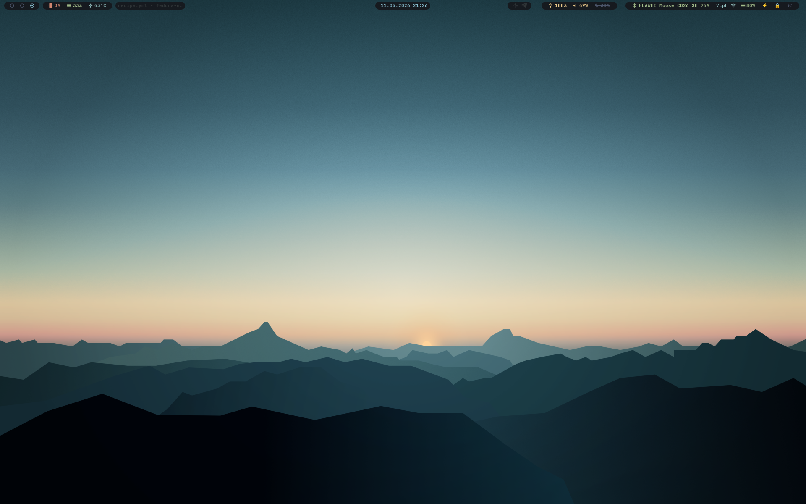

# Fedora Niri Atomic

Fedora Atomic image with a Niri desktop.

dotconfig for:

- `niri`
- `waybar`
- `mako`
- `fuzzel`
- `swaylock`

## Screenshot



Variables:

- `VPN_NAME` in `files/configs/waybar/scripts/vpn.sh` — set it to your VPN connection name
- `TIMEZONE` in `files/configs/waybar/config.jsonc` — set it to your timezone

## Rebase

Rebase an existing Fedora Atomic/bootc system to this image:

```bash
sudo rpm-ostree rebase unsigned:docker://ghcr.io/vlados-it/fedora-laptop-niri:latest
sudo systemctl reboot
```

After rebasing to the signed version:

```bash
sudo rpm-ostree rebase ostree-image-signed:docker://ghcr.io/vlados-it/fedora-laptop-niri:latest
sudo systemctl reboot
```

## Update

```bash
rpm-ostree upgrade
```

## My setup

- **Laptop:** Huawei MateBook D 16 (2024)
- **CPU:** Intel Core i5-13420H (Raptor Lake)
- **RAM:** 16 GB
- **GPU:** Intel UHD Graphics
- **Display:** 16" IPS, 1920×1200 @ 60 Hz
- **Wi‑Fi:** Intel AX201
- **Bluetooth:** Intel AX201
- **Storage:** 512 GB NVMe SSD
